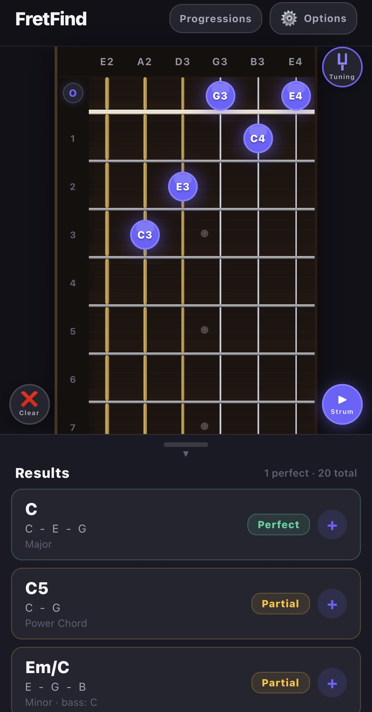
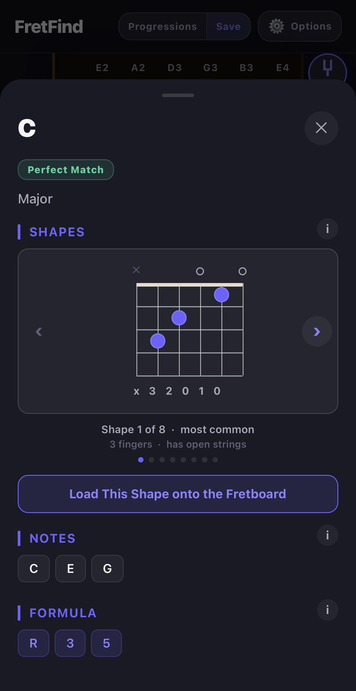
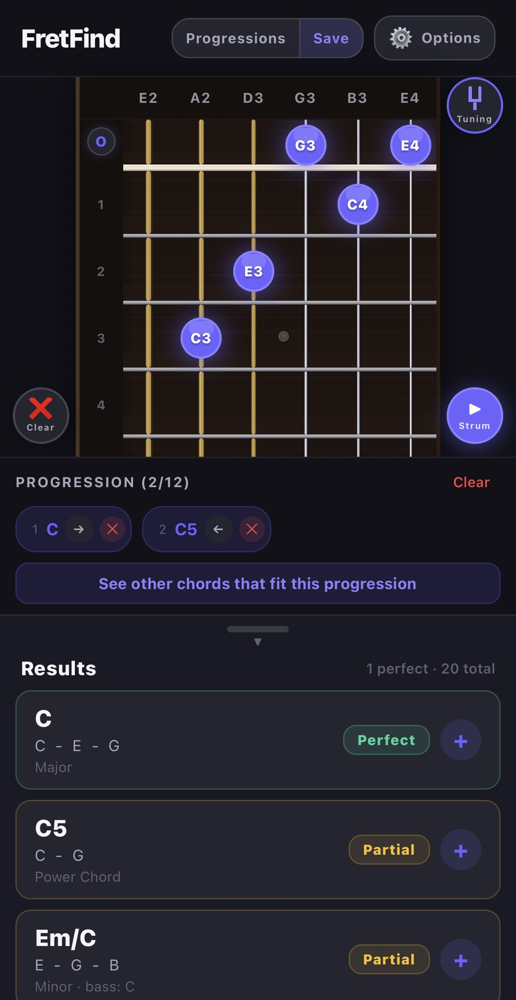
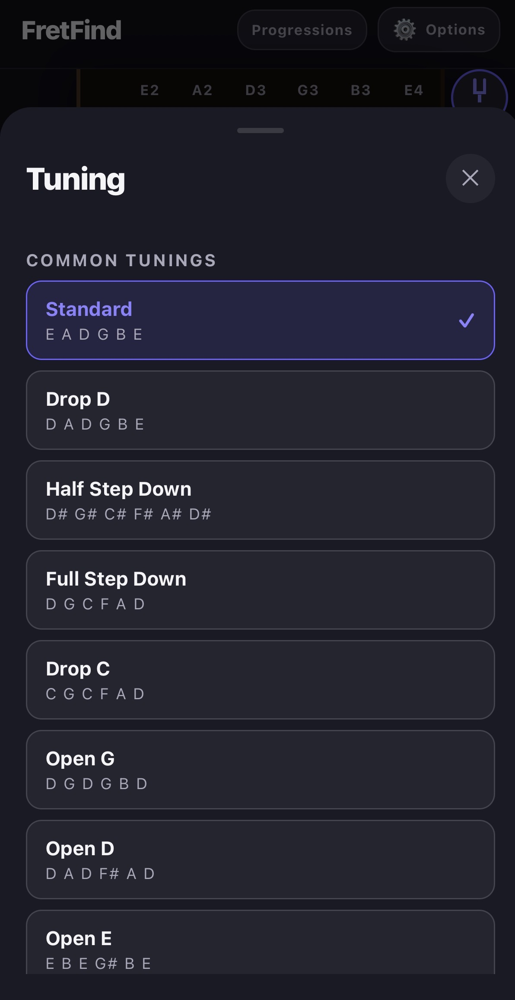
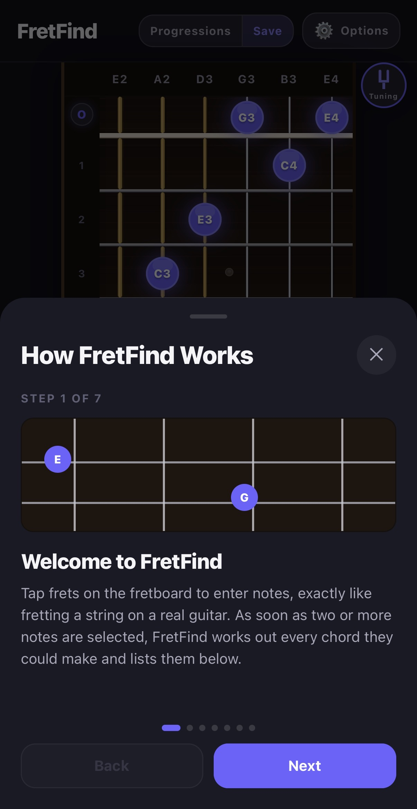
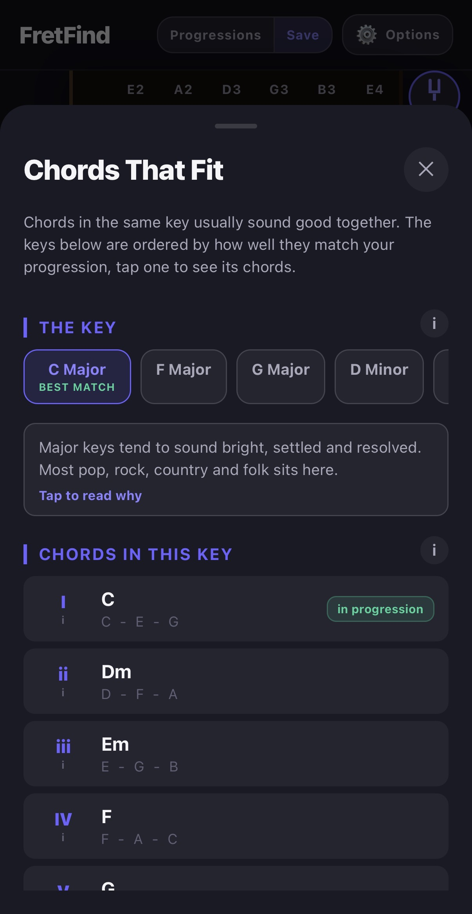
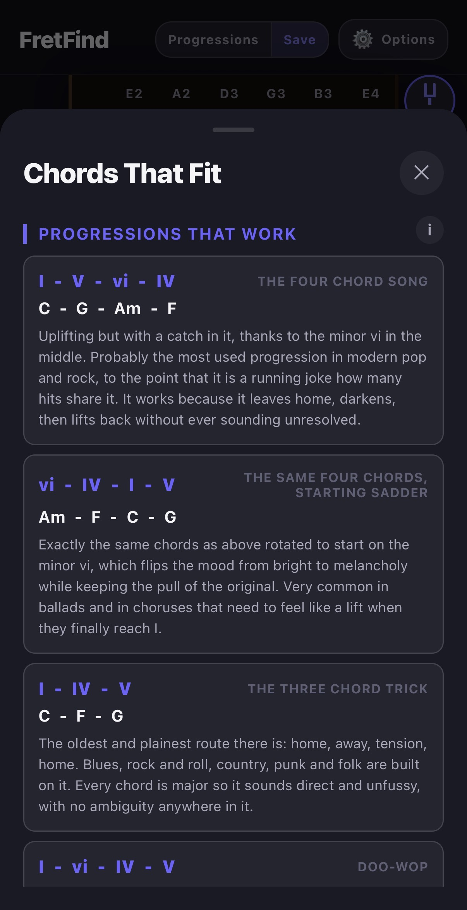
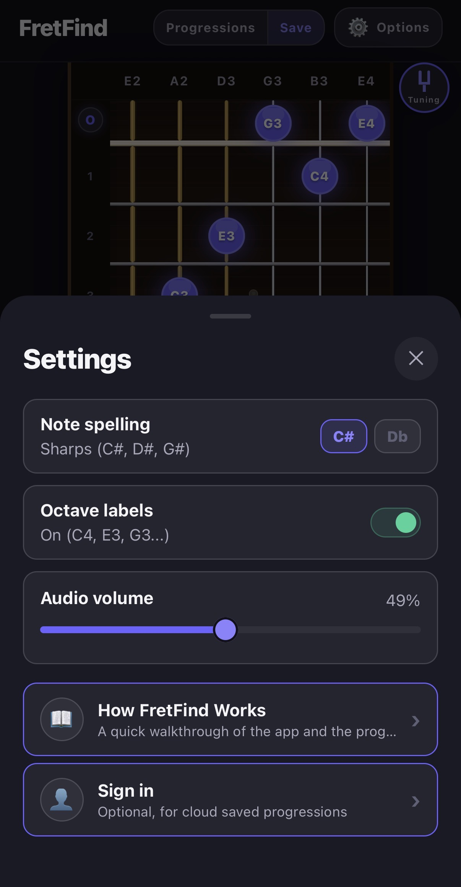
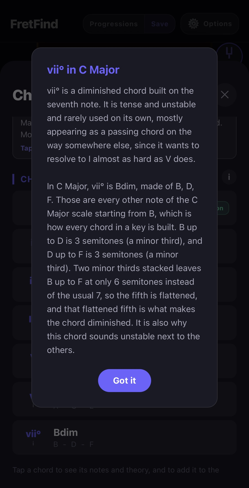
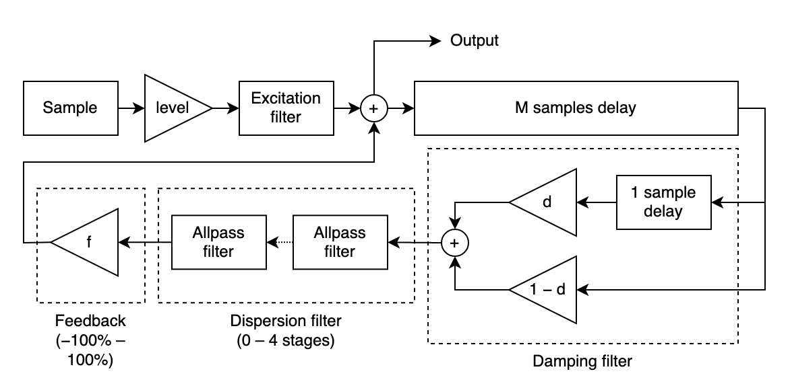

# FretFind: Final Project Report

**Sebastian Landry, EECS4080**
**May 27, 2026 to August 4, 2026**

---

## Abstract

FretFind is a mobile app that identifies guitar chords in reverse: rather than looking up a chord name to find its notes, the user selects notes on a virtual fretboard and the app works out which chords they form, explains the underlying theory in plain language, and suggests further chords that fit a chord progression.

The project represents notes and chords as sets of integers modulo twelve, following the mathematical treatment of pitch class in Dave Benson's *Music: A Mathematical Offering*, which lets chord identification, key inference, and playable fretboard shape generation all be implemented as small brute force searches over the same numeric representation rather than as three separate systems.

Built with React Native and Expo across eight deliverables, the app also generates its own guitar-like audio on the device using Karplus-Strong plucked string synthesis, supports nine preset tunings plus custom tunings, and provides an optional cloud backed account for saving chord progressions.

The chord matching and shape generation algorithms are verified by four automated test suites covering 31 chord types and thousands of generated fretboard shapes, and the interface has been refined through closed testing with 30 users. This report covers the project's design and algorithms, the sources that informed them, the mistakes made and lessons learned across development, and the work planned but not completed within the project timeline.

---

## 1. Introduction and Purpose

FretFind is a React Native and Expo app for reverse guitar chord finding. Instead of searching for a chord name first, the user selects notes on a virtual fretboard and the app identifies the chord being played.

Every common chord tool out there uses the same approach: it goes from a name to the notes, you look up "Cmaj7" and it shows you where to put your fingers. (Only one other app I found works in a similar way mine does, but it lacks obvious features like chord breakdowns, voicing generation, progressions and educational information. FretFind is designed to be a complete learning tool for someone who can play a few chords but does not know the theory behind them.)

That inversion from the common approach is the whole project and it comes from a real problem. A guitarist can hold a shape without even knowing its name, can stumble onto something that sounds good without knowing why it works, and usually does not know what key they are in. As a self-taught guitar player I know how hard it can be to learn the theory behind the chords you play. Every design decision in this app follows those assumptions: the app never asks what key you are in, and every piece of theory it shows is explained in plain language rather than in the vocabulary you would need a teacher to have already given you. If users wish to learn further, they can expand on the explanations in the app by clicking on the explanation icons to explore all concepts.

The original contract set out six things the app should help someone learn:

- Fretboard navigation and note recognition
- Chord construction
- Intervals and chord formulas
- Inversions and slash chords
- Alternate tunings
- How chords fit into progressions

All six were successfully implemented in the application. Fretboard navigation and note recognition are the fretboard itself with its note labels, and octave, plus the sharp and flat preferences. Chord construction, intervals and formulas are the chord breakdown sheet. Inversions and slash chords are detected by the matcher and shown as their own match type. Alternate tunings are nine presets plus a custom builder. Progressions are the progression strip and the 'Chords That Fit' key suggestions.

The app is built in React Native on Expo SDK 54, written in TypeScript, with an optional (for users) Supabase backend for accounts and cloud saved progressions. It is mobile only, portrait view only, and works completely offline. The account is optional: nothing in the chord matching, the audio, the tunings or the progression builder touches the network.

---

# Contributions

This project's contributions are the app itself and the code behind it: Section 2 covers what was built and when, across all eight deliverables, and Section 3 covers the technical design, the algorithms, and the reasoning behind them.

## 2. Milestones and What Was Built

The project ran across eight deliverables in ten weeks. The reasoning behind the technical choices is in Section 3, and the things that went wrong are in Section 6 of this report.

The deliverables summarized:

| Deliverable | Dates            | Goal                           | What shipped                                                                                                         |
| ----------- | ---------------- | ------------------------------ | -------------------------------------------------------------------------------------------------------------------- |
| d1          | May 27 to Jun 8  | Outline and skeleton           | Contract, scope, wireframes, three controller classes, mock data, a hardcoded proof of concept,`npm run test:mock` |
| d2          | Jun 8 to Jun 19  | The fretboard                  | Interactive 6 string board, frets 0 to 22, core note and tuning data structures                                      |
| d3          | Jun 19 to Jul 3  | Reverse chord matching         | The matcher, real time results, the state lift, early-mid status report                                              |
| d4          | Jul 3 to Jul 10  | Tests and refinements          | Runnable matcher test suite, octave labels, sharp/flat preference, adjustable results panel, store profiles          |
| d5          | Jul 10 to Jul 17 | Expanded chords and theory     | 31 chord types, the weak match grade, the chord breakdown sheet, mid-project status report                           |
| d6          | Jul 17 to Jul 24 | Audio, progressions, backend   | Tone synthesis from scratch, progression builder, 'Chords That Fit', Supabase accounts, info site                    |
| d7          | Jul 24 to Jul 31 | Tunings, voicings, cloud fixes | Nine tunings plus custom tuning option, voicing generator, cloud rework, the freezing fix                            |
| d8          | Jul 31 to Aug 4  | Finishing                      | Walkthrough, clear button, small device fixes, deeper theory explanations, final documentation                       |

### d1: Outline and skeleton

I wrote the contract, the scope, the wireframes for the basic app outline, and a skeleton of three controller classes with mock data behind them: `FretboardInteractionController`, `ChordAnalysisController`, `ProgressionController`. The proof of concept was a hardcoded C major chord printed to the console, and the mock test file `basicControllers.mock.test.ts` verified that the controllers were wired up correctly.

The main thing worth noticing about d1 was clear at the end of d8: that initial three test classes survived all eight deliverables without ever being restructured, the same logic applied throughout. The fretboard, the analysis and the progression stayed genuinely separate concerns from the first week to the last, and the three controller files still exist with those names. Deciding that before writing any real code was the foundation of the whole project.

### d2: The fretboard

The interactive board: six strings, frets 0 to 22, tap a fret to select it, tap again to clear, and an 'O' button at the nut that fills every empty string with its open note. Underneath it in the logic of the project: the data structures for pitch classes, string indexs, fret selections and tunings.

I had planned to define intervals and chord formulas in d2 as well, and I moved them into d3 partway through. That was deliberate rather than running out of time: I realized the formula representation should be designed together with the matcher that takes its input, not guessed or undefined a week ahead. It was the first change to the schedule and I believe it was the right call.

### d3: Reverse chord matching

The first major component of the app. The matcher takes a set of tapped notes and returns a ranked list of named chords, instantly in real time as you tap. (Section 3.2 covers how)

The other thing that happened here was a fix rather than a feature. The selected notes originally lived inside the `Fretboard` component, which meant the new results panel could not see them. I moved that state up into `App.tsx` so both read from one place, in the core of the app. That is the reason the board and the results can never disagree about what is selected and it is the pattern the whole app used since. This was a good learning opportunity: I had to understand React state and props well enough to know when to move the state up to the App.

The early-mid project status report was written at the end of this deliverable.

### d4: Tests and refinements

Up to this point I had verified the matcher by hand: I checked C major, Cmaj7, C7, Am and the C/E inversion through manual testing by myself. Which is not the thorough testing that I wanted, d4 replaced teh manual testing with a real test that runs from the console and prints what it checked. Input was given, and the chords were properly identified, including inversions and slash chords. The test file is `src/tests/d4-chord-matcher-tests.ts` and it runs with `npm run test:chords`.

Alongside that I implemented: octave labels (E2 rather than just E), a sharp or flat spelling preference, an adjustable results panel, and setup the App Store and Google Play profiles.

The ordering here mattered more in the end than it seemed at the time. The tests were implemented before d5 tripled the size of the chord table, which is why that expansion was a low risk implementation, since I had verified the existing matcher worked flawlessly before adding the more complicated chord shapes.

### d5: Expanded chords and the theory display

The chord table went from just the commond chords, triads and sevenths, to 31 chord types, adding the added tone chords (example: Cadd9) and the common extended chords (example: Cmaj9). Because the matcher reads formulas from a table rather than having them written into its logic, this was simply researching what makes each chord unique and then adding rows.

Two important things came out of it:

- First, I split the old partial match grade in two ('Weak' matches, and 'Partial' matches): partial now means every essential note is there, and weak means only about half of them are, shown in red so a weak guess is visibly different from a close one. The original single grade encapsulated too much information and was not too useful to the user, so I split it into two.
- Second, writing the tests turned up a genuine theory problem: a bare root, 11th and b7 (a root, 11th note in scale, and flat 7th note in the scale) is the same set of notes as a 7sus4, because the 11th and the 4th are the same pitch class. Which really isnt a bug, the notes really are identical, so the fix was to require the 9th to be present before naming something an 11th, letting the simpler reading win.

This deliverable also added the chord breakdown sheet: tap a result and get the match grade ('Perfect', 'Partial', or 'Weak'), the formula of notes in the chord and its importance to the chord (colur coded: 'essential' or 'non-essential'), every interval with its full name and the note it lands on, and the voicing when the lowest note is not the root. Every section heading has a small 'i' button opening a plain language explanation for the concept.

The mid-project status report was written at the end of this deliverable.

### d6: Audio, progressions, and the backend

The largest deliverable by far, implementing three large features: audio, progressions, and the backend.

The audio is a tone generator built from scratch, because React Native has no way to make a sound out of nothing. It generates a sine wave at the right frequency for each note, and then mixes them together for chords. (Section 3.5 covers it in detail, including the two rebuilds it went through)

The progression builder: a strip of chords the user collects, each remembering the exact fretboard shape it was played as, so tapping a chord's pill later puts that shape back on the board. Progressions can be named, saved on the device, reordered and reloaded.

'Chords That Fit' (key feature): the app works out which key the progression most likely lives in and shows the other chords built from that key, so someone stuck for the next chord has a list worth trying. (Section 3.3 covers the logic behind it, and Section 3.4 covers the voicing generator that makes the shapes for those chords)

The backend: Supabase accounts and cloud saved progressions, plus the FretFind info site (privacy policy, terms, account confirmation, password reset) deployed separately to GitHub Pages.

### d7: Tunings, voicings, and cloud fixes

The `Tuning` type had been designed originally in d2, so the app could hold more than one tuning, but the fretboard was hardcoded to standard tuning since the start. in d7 I made it switchable: nine common tunings (Standard, Drop D, Half Step Down, Full Step Down, Drop C, Open G, Open D, Open E, DADGAD) plus a custom builder that saves user tunings on the device.

Then, making tuning switchable is what allowed the next feature to be built properly. Up to then the app only ever knew one shape per chord type (in theory, since it was written to be adaptive), whatever the user tapped. I wanted to show the other ways to play the same chord and the obvious approach I found that would be most helpful for guitarists was to generate the shapes dynamically based on the current tuning. A table of fret numbers per chord type per root, would have been hundreds of rows that all became wrong the moment the tuning changed. So the shapes are generated from whatever tuning is currently loaded. (Section 3.4 covers the voicing generator in detail, including the rebuilds it had)

This also closed an issue I had deliberately left open in d6, where I delayed to hardcode a single fixed shape for the 'Chords That Fit' suggestions because I knew the voicing feature was coming and did not want to build something I would have to revamp or throw away.

The rest of d7 was spent on the cloud saved progressions. Once it was was implemented, three separate problems appeared which are covered in Section 6 of this document

### d8: Finishing

The app walkthrough: a step by stepexplanation of the apps features in the Settings screen, aimed at someone opening FretFind for the first time and separate from the theory explanations in the app.

A clear button for the fretboard, kept deliberately distinct from the progression strips 'Clear' button (different side of the screen, different icon and an undo option) because two buttons called "Clear" doing very different things on the same screen could be a very easy mistake to make.

Small device fixes, which came directly out of the closed test rather than out of my own testing. On smaller Android phones the interface was running underneath the status bar at the top and the gesture bar at the bottom, and the close buttons on the sheets were too small to reliably tap. (Both are covered in detail in Section 6)

Deeper theory explanations in 'Chords That Fit': what a key is, what the roman numerals mean, how major and minor tend to feel and the chord progressions that keep recurring in real songs, each with the mood and the genres it belongs to. (Section 3.3 covers what the theory such as the numerals say)

### Overall: The app and its features

- A 6 string interactive fretboard, frets 0 to 22, in any of nine tunings, plus custom tunings saved on the device
- Real time reverse chord identification for 31 chord types, with inversion and slash chord detection and three match grades (Perfect, Partial, Weak)
- A plain language theory breakdown for any chord: notes, formula, every interval named, and the voicing
- Generated playable shapes for any chord in the current tuning, loadable straight onto the board
- Plucked string audio for single notes and strummed chords, generated on the device in real time
- A progression builder holding up to 12 chords, each remembering its exact shape, saved on the device
- Key inference across 24 candidate keys, with the chords of that key explained and the common progressions spelled out in it
- Optional accounts with cloud saved progressions, and the ability to move a progression between the device and the account in either direction
- Display options for note spelling and octave labels, an audio volume control, and an in-app walkthrough

---

## 3. The Computer Science

### 3.1 The foundational idea: music as modular arithmetic

Everything else in this project rests on one decision I made early on, even when planning the project, which was then expanded on when reading through Dave Benson's *Music: A Mathematical Offering* (Cambridge University Press. the copy I used is the free online edition dated 14 December 2008). The book is about the mathematics of music, and it is the main source for the representation of notes and chords in this app.

A note without its octave is a pitch class, and there are exactly twelve of them. So a note is an integer from 0 to 11, and moving up one fret is adding one, modulo twelve. Once notes are numbers in Z/12, everything musical becomes math:

- An interval is subtraction mod 12.
- A chord is a set of intervals measured from a root.
- Transposing a chord is adding a constant to every element of that set.
- The same chord shape at a different position on the neck is the same set under a different offset.

I got this outline from "Music: A Mathematical Offering", specifically chapter 9.6, "Clock arithmetic and octave equivalence", where it defines clock arithmetic on twelve elements as the group Z/12, defines two notes as belonging to the same pitch class when they differ by a whole number of octaves, and then prints the correlation C=0, C#=1, D=2, to B=11. That idea is exactly what I used in my `PitchClass` type. Chapter 9.14 then defines a pitch class set as a subset of the twelve notes, which is what I used for my chord representation and I named the operation of adding a constant to every element as transposition to fit more with the wording of guitar playing.

The alternative would have been to work with note names as strings. Every operation would be a lookup, as in every note harmony case, and every new chord type a new branch. Choosing numbers instead is the main reason the matcher is only forty lines of mathematical operations rather than a pile of conditionals, which would have been much more complex to maintain and implement in the first place.

### 3.2 Reverse chord matching

(Located in `src/engine/chordMatcher.ts`)

The main problem I needed to solve when making the app: when between two and six notes are selected by the user, find out which chords those notes could represent and rank them.

Normally you pick a chord name first and then look up the notes. This app works the other way around: you pick the notes and it works out the chord. That is the reverse part, and thus the main technical idea of the project.

The matching works in these steps:

1. Collect the notes: Every tapped fret has a pitch class (the note without its octave). Repeated notes are ignored, so two C notes count as one C, as this is irrelevant to the chord type.
2. Try every note as the root: A chord is named after its root note (the note it is built from). The app does not know the root yet, so it tries all twelve notes as a possible root, one at a time.
3. Measure the gaps: For each possible root, the app measures the distance from the root up to every selected note. These distances are called intervals, and they are counted in semitones (one fret is one semitone).
4. Compare against the chord formulas: Each chord type has a formula, which is the set of intervals that make it up. A major chord is the root, the major third (4), and the perfect fifth (7). If the gaps match a formula, we have found a possible chord.
5. Score and rank: Many chords can fit the same notes, so each match is given a score. Matches that have all the important notes, the root as the lowest note, and no extra notes score higher. The app sorts the matches from best to worst and shows the strongest ones first.

A match is marked perfect when all the essential notes of the chord are present and nothing extra is added. It is marked partial when most of the essential notes are there but one is missing or one extra note is added, and weak when only about half of them made it (the weak grade was split out of partial in d5, since one grade was covering too much). The app also notices when the lowest note is not the root, which means the chord is an inversion or a slash chord (the same chord, but with a different note in the bass).

Example: tapping C, E, and G gives the gaps 0, 4, and 7 from C. That matches the major formula exactly: the intervals 0, 4, and 7 and theory wise that is the major chord, which is 1 3 5 in terms of scale degrees, so the best match is C major.

The chord formula table covers 31 chord types by the end of the project: the common triads (major, minor, diminished, augmented), power chords, suspended chords (sus2, sus4), sixth chords, the seventh chords (dominant 7th, major 7th, minor 7th, minor major 7th, diminished 7th, half-diminished 7th, augmented 7th, 7sus4, 7sus2), and the added tone and extended chords added in d5.

**Why trying every possibility is the right answer:** Twelve possible roots against 31 chord types is 372 comparisons, each on a set of at most six small numbers. That is nothing for a phone, it runs on every single fret tap without a stutter, and it stays cheap because the chord table grows by tens of rows rather than thousands. The alternatives I considered were working outward from the most common chords, or listing every possible chord name and testing each, and both are slower and more complicated for no benefit when the number of possibilities is this small.

**Essential versus optional notes:** the idea this whole project reuses the most. A chord type stores not just its notes but which of them it cannot do without, the essential notes. A C major chord can lose its G and still obviously be C major, but it cannot lose its E, because the E is the entire difference between major and minor. That distinction is what makes the three match grades possible, what lets the extended chords name correctly from a four note shape a guitarist can actually hold, and what the voicing generator uses to throw out invalid shapes three deliverables later (Section 3.4).

**One problem I could not solve:** Am7 and C6 contain the exact same four notes (A, C, E, G). There is no way to choose between them from the notes alone, because the right answer depends on the key, which the matcher is not expected toknow. I decided the best course of action is to use a simple scoring system that favours the simpler and more common reading, but the weights are my own judgment and thus is subjective. I raised this in the early-mid report, said I would revisit it, and in the end I decided to leave it as it was. It is still a limitation.

### 3.3 Key inference

(Found in `src/engine/keyMatcher.ts`)

The same approach as the chord matcher, one level up, from chords to keys.

The app does not ask the user what key they are in, since the average guitar player would not know unless told, or unless they were trained on theory. Instead it reuses the same brute force idea as the reverse chord matcher itself: try every possibility and score how well it explains what is already there, then the best score wins.

1. **Define what a key actually is, as data:** A key is just a starting note (the tonic) plus a pattern of gaps: major is `[0, 2, 4, 5, 7, 9, 11]` semitones up from the tonic, natural minor is `[0, 2, 3, 5, 7, 8, 10]`. Stacking every third note of that pattern gives the seven chords the key is built from (in major: major, minor, minor, major, major, minor, diminished, the familiar I ii iii IV V vi vii° pattern), stored as lookup tables in `src/constants/scales.ts` rather than written out by hand for all 24 keys.
2. **Try every key against the progression:** There are only 24 real candidates (12 tonic notes, major or minor), so a simple loop checks all of them. For each chord already in the progression, the code checks whether that chord's root note even belongs to the candidate key's scale, and whether the chord's actual quality (major, minor, or diminished, worked out from its symbol) matches the quality that key would naturally put on that scale degree. (Almost instant)
3. **Score and rank:** A chord that matches a key exactly (right root and right quality) scores higher than one that only shares a root note with it. The scores are added up per key, the keys are sorted best first, and the top one becomes the default, the same 'best match rises to the top' approach the chord matcher already uses.
4. **Turn the winning key back into chords:** Once a key is picked, its seven scale degree chords (with their roman numerals) are generated straight from the same interval table used to rank it, and cross checked against the current progression so the ones already in use can be marked. Tapping one of these builds a normal `ChordMatch` object so it can reuse the exact same theory breakdown sheet a real fretboard match opens, rather than needing a second display built just for suggestions.

Because this rides on the same data shapes as the reverse chord matcher (chord symbols, pitch classes, `ChordMatch`), no new matching engine was needed, only the key and scale layer on top. That is a decision made in d3 which ended up paying off in d6, seen as the number based representation in 3.1 was worth choosing.

**Explaining the roman numerals (d8):** Showing someone "vii°" (seven diminished) with no explanation is not teaching. The numerals now explain themselves in two halves. The first half is fixed text about what that degree does in any key. The second half is generated for the key actually on screen, naming the real notes and working out the quality from them.

Tapping vii° in C Major gives:

- In C Major, vii° is Bdim, made of B, D, F. Those are every other note of the C Major scale starting from B, which is how every chord in a key is built. B up to D is 3 semitones (a minor third), and D up to F is 3 semitones (a minor third). Two minor thirds stacked leaves B up to F at only 6 semitones instead of the usual 7, so the fifth is flattened, and that flattened fifth is what makes the chord diminished.

The point is that the chord quality is not a rule someone invented that has to be memorized. It falls out of the scale itself. The generated text works out those interval sizes from the same table the rest of the app uses, so it can never disagree with the code, and teaches the user in a plain language way with a real example.

### 3.4 Voicing generation

(Found in `src/engine/voicingGenerator.ts`)

What I think personally is the most interesting algorithm in the project.

Up to d7 the app only ever knew the one shape the user happened to tap. It could name that shape, explain it, and add it to a progression, but it could not show any of the other ways the same chord gets played. Which was a real gap, since the whole point of the app is learning the fretboard, and a chord being playable in five different places is most of what makes the fretboard hard to learn in the first place, you can memorize one shape, but not the others.

How the shapes get worked out (no hardcoded shape tables):
Hardcoding shapes would mean a table of six fret numbers for every chord type at every root, which is hundreds of rows that would all be wrong the moment the tuning changes. And since d7 had just made the tuning changeable, that is not a good option. So the shapes get generated from the tuning the same way everything else in the app already works:

1. **Find every place each chord note lives:** For each string, walk up the frets and note which ones land on a pitch class that belongs to the chord. This comes straight from the open string notes, so it follows whatever tuning is currently selected.
2. **Slide a window up the neck:** A real hand covers about four frets at once (typically, many talented guitar players can span more, but for the sake of this project I wanted to pick a realistc number), so the search looks at one four fret window at a time, from the nut upward and only considers notes inside it (open strings always count as playable since an open string needs no finger).
3. **Pick one note per string, or mute it:** Inside a window each string either plays one of its available chord notes or is left out. That gives a set of candidate shapes per position.
4. **Throw out the ones that are not really the chord:** A shape only counts if every essential interval of the chord is actually sounding. This reuses the same essential interval idea the matcher has used since d3, so a voicing can leave out a fifth but never the third that makes it major or minor.
5. **Count the fingers, and throw out anything a hand cannot hold:** This is what decides whether a shape is real rather than only theoretically correct. Open strings cost no finger. Every fretted note costs one, except the index finger lying flat across the lowest fret of the shape, which is a barre and covers as many strings as it reaches. The barre only counts from the lowest fret, since the index has to sit under the other fingers rather than over them, and only when every string it crosses is sounding at that fret or higher, otherwise the finger would deaden a string that is meant to ring. Anything still needing more than four fingers is dropped outright rather than just ranked lower.
6. **Score for playability and rank:** Shapes score higher for having the root in the bass, using more strings, having a smaller fret span, sitting lower on the neck, and needing fewer fingers, with open strings a strong bonus since those shapes are both easier and the ones taught first. Best score first, so the shape a real player would reach for first is the one shown first.

The pruning in steps 1, 2, 4 and 5 is what makes this possible at all. Left unconstrained, each of six strings could be muted or set to any of its 23 positions, which is 24 to the power of 6, about 191 million combinations. Cutting the candidate frets down to chord notes only, then to one hand position at a time, then discarding anything musically or physically invalid, brings that down to only a few thousand real shapes per chord.

On optional notes, since this is what makes the difference between a shape that is playable and one that is not: a shape only ever has to contain the chords essential notes, never all of them. That is what the essential intervals in the chord table have meant since d3, and it matters more here than anywhere else in the app, as of course it is nice for the user to know if a note is essential or not, but it is crucial to making a chord playable or not. A major chord needs its root and its third but not its fifth, so dropping the fifth to get a shape a hand can actually hold is the right trade, and the scoring only mildly prefers the fuller sounding version. The aim is to find ways to play the chord, not to cram in every note it could theoretically contain.

This is the same brute force and score approach the chord matcher and the key matcher already use, which keeps it consistent with how the rest of the app thinks, and means it works for every chord type in the table without any per-chord special casing. It is almost instant on a modern phone, and the typescript tests confirm it is returning the right shapes for the chords I already know how to play.

### 3.5 Audio synthesis

React Native has no built in way to make a sound out of nothing, so in the app I built my own audio synthesis system (or MIDI, Musical Instrument Digital Interface), step by step:

1. **Turn the fret into a note number:** Every fret already had a MIDI style number since d5 (the open string number plus the fret), so this step was already done.
2. **Turn the note number into a frequency:** Using equal temperament: A4 is fixed at 440 Hz, and every semitone away from it multiplies the frequency by the twelfth root of two. This is the standard tuning system a guitar already uses.
3. **Draw the actual sound wave:** The code walks through the tone sample by sample and works out where the wave should be at that instant.
4. **Package it into a real (.wav) sound file:** The samples are wrapped in a plain WAV file header, byte by byte, then turned into one long line of text (base64) that the phone's audio player can load directly, no separate file needed.
5. **Play it:** The player (`expo-av`) loads that line of text like any other sound file. Each note's sound is generated once and reused after that, so repeat notes are instant. A strum plays each note a little after the one before it, low string to high string, the way a pick actually crosses the strings.

However, after completion of this initial idea, step 3 went through two versions. The first drew a sine wave and added two quieter copies an octave and an octave-and-a-fifth up so it had some body instead of sounding like a flat electronic beep, with a fade multiplying the whole thing down over time. It sounded thin and frail no matter the fixes I tried around it.

The version that I ended up using in the final product uses plucked string synthesis (Karplus-Strong, which is physical modeling method that creates the sound of a plucked string, using an algorithm): a burst of noise fed into a loop one wave cycle long, averaged and slightly quietened on every pass, which behaves like a real plucked string settling from chaos into a ringing pitch. It costs less per sample than the three sine calls did, so the sample rate went back up to 22050 Hz and the notes ring for over a second, with low notes naturally ringing longer than high ones, exactly like real strings. This version was much more advanced yet somewhat simpler than the first, and it sounded much more like a real guitar. The Karplus-Strong algorithm is explained in detail in the sources below, and the diagram shows how it works.

Sources I used to help me understand and build the Karplus-Strong algorithm:
https://ccrma.stanford.edu/~jos/pasp/Karplus_Strong_Algorithm.html
https://flothesof.github.io/Karplus-Strong-algorithm-Python.html
https://github.com/imdanielsp/Karplus-Strong-simulation

Why that works is worth noting, since it is the least obvious algorithm in the project, but made a large quality difference: The noise burst contains every frequency at once, which is physically what a plucked string is in the instant the pick lets go. The length of the loop decides which frequency survives, so the loop length is the pitch. Averaging each value with its neighbour is a filter that kills high frequencies faster than low ones, which is what a real string does as it loses energy. And because low notes need longer loops, they ring longer without that being programmed in anywhere.

**Something I got right for the wrong reason:** When I halved the sample rate to 11025 Hz to fix the lag in d6, I wrote in my notes that it still covered the fretboard with room to spare, meaning it could handle the full range of notes without any issues and more, which was a feeling rather than an argument. The real justification is in Nyquists theorem (Benson chapter 7.6): the highest frequency you can represent is exactly half the sample rate. The highest note the app can play is fret 22 on the high E string, about 1170 Hz, so even at 11025 Hz the limit is 5512 Hz, well above that note and several of its harmonics. That is why halving it did not audibly alter the sound in a negative way.

I dowish I had the time to add real guitar sounds, a real audio sound for each note, but that is a much bigger project and I did not have the time to complete it in this timeline. The audio I ended up with is much closer to a real guitar sound than the simple sine wave I had before, and it is still a playable tone that is good enough for this app and for myself.

### 3.6 Techniques used across the whole app:

**Keeping data separate from logic:** The chord types, scale degrees and tunings are all data tables that the code reads, so adding a chord type is adding a row rather than touching the matcher logic. I predicted in the mid-project report that this would make new chord types cheap and it held true: d5 tripled the chord table, d6 added the whole key layer on top of the same structure, and d7 generated shapes for any tuning. These were all a additions not rewrites, making the app more maintainable and extensible. My original planning and prediction helped me make the right decision early on and it paid off.

**One shared shape between parts:** `ChordMatch` is produced by the chord matcher, produced again by the key matcher for suggestions, and displayed by the breakdown sheet in order to provide consistency across the app, across hundres of chords, keys and tunings.

**One place for the selected notes:** The tapped notes live in `App.tsx` and are passed down, so the fretboard and the results cannot disagree.

**Not redrawing things that did not change:** The fretboard is 23 rows (22 frets) of wood grain, strings and shadows, so redrawing all of it on every tap was visibly slow and caused lag across the whole app. Skipping rows whose own notes did not change fixed slowness issues and I used the same idea to quicken the audio where each notes sound is generated once and reused, until the the memory gets close to full

**Telling two saved progressions apart:** Whether a progression on the phone matches one on the account cannot be decided by an solely ID. The app identifies them by content: the name, plus every chords name and exact frets. Because the same name can be different notes in two tunings and the same frets can be different chords in two tunings, the only way to be sure is the check the whole progression, as I implemented.

**Keeping the account optional:** Accounts and cloud saving were built separately from the core app, so that chord matching never depends on a network or a login. When the cloud code turned out to be buggy in d7, none of it could take the rest of the app down with it, which was exactly like I had planned, if the app was built with the backend being mandatory for users it would have been unusable until the cloud was fixed. In addition it would be less accessible to users who do not want to create an account, which is an unnecessary barrier to entry for a learning app.

**A note on cost:** All three search problems above (372 comparisons for the matcher, at most 288 for key inference, and a few thousand shapes for the generator) are small enough that checking every possibility is both the simplest and the fastest thing to write. This was measured rather than assumed, which is what makes "try everything" a decision here rather than a convenient shortcut. Tests confirm the matcher and key inference are essentially instant, and the voicing generator is fast enough to run on every fret tap without a lag.

---

## 4. Related Work

Section 1 already notes the one comparable app found during research, and that it lacks the chord breakdowns, voicing generation, progressions and educational information this project set out to provide. This section covers the other half of related work: the written and technical sources drawn on to build FretFind, and what specific idea came from each one.

### Music: A Mathematical Offering, Dave Benson

This book was most important source for the mathematical musical foundations of the app.

**The topics that the whole app rests on:**

- **Chapter 9.6, Clock arithmetic and octave equivalence (p.319 to 320).** Defines clock arithmetic on twelve elements as the group Z/12, defines a pitch class, and gives the table C=0 through B=11. This is my `PitchClass` type and the reason the matcher is math rather than slow individual lookups.
- **Chapter 9.14, Pitch class sets (p.332).** "A pitch class set is defined to be a subset of the set of twelve pitch classes." (in simple terms means a chord is just some of the twelve notes picked out, with the octave thrown away) which is exasctly my common sense chord representation.

**Scales and chords:** Chapter 5 (p.153 to 199), especially 5.6 Major and minor, 5.7 The dominant seventh, 5.11 Classical harmony, and 5.14 Equal temperament. This is the grounding for the chord table in `src/constants/chords.ts` and the scale data in `src/constants/scales.ts`.

**Audio, all of which I built by hand:**

- **Chapter 8.5, The Karplus-Strong algorithm (p.262 to 263)**, and 8.6, the filter analysis behind it. The technique in `toneGenerator.ts`. The original paper is Karplus and Strong, "Digital Synthesis of Plucked-String and Drum Timbres", Computer Music Journal 7(2), 1983, pages 43 to 55, but Bensons version is what I mostly worked from.
- **Chapter 7.3, WAV and MP3 files (p.238 to 239).** The WAV format byte by byte: a 12 byte RIFF chunk, a 24 byte FORMAT chunk, then the data, all little endian (which is standard for WAV files).
- **Chapter 7.4, MIDI (p.241).** MIDI numbers every note on a keyboard with a single whole number, so one number carries both the note and the octave it is in. I took that idea and used it as the one way the app describes a note internally. `getOpenStringMidi` turns each strings open note and octave into its MIDI number with `(octave + 1) * 12 + pitchClass` (for example, the fret open high E string is note 64, which is E4). Then from there a fretted note is just that number plus the fret, since one fret is one semitone and MIDI counts in semitones (for example, the note on the 5th fret of the open high E string is 69, which is B4).
  That single number then does three separate jobs: it is what gets played (`playNote(baseMidi[string] + fret)`), it is what the octave labels are worked back out of (dividing by 12 and subtracting 1 gives the octave, which is how the board can show "E2" instead of just "E"), and it is what the frequency is calculated from below. Having one number rather than a note and an octave kept separately is also what the octave bug in section 6.4 of this document is about, since that bug came from the two being stored apart and drifting.
- **Appendix E, Equal tempered scales (p.377), and Appendix F, Frequency and MIDI chart (p.379).** These give the formula for turning a note number into an actual frequency in Hz and the anchor point it needs. Equal temperament means every semitone multiplies the frequency by the twelfth root of two, and the chart fixes MIDI note 69 as A4 at 440 Hz. Those two facts are the whole of `midiNoteToFrequency`, which is one line: 440 * Math.pow(2, (midiNote - 69) / 12). Everything the app plays goes through that function, this is the place where a number on the fretboard becomes a pitch.
- **Chapter 7.6, Nyquist's theorem (p.244).** The theorem says the highest frequency you can record or reproduce is exactly half the rate you are sampling at. That is what decides how many samples per second the tone generator needs to produce. The highest note the app can play is fret 22 on the high E string, around 1170 Hz, so at the 22050 Hz the generator uses by default the limit is 11025 Hz, which leaves room for the note and its harmonics on top (to make it sound better, the harmonics are higher frequency pitches). It also told me how far I could safely drop that rate when the audio was making the app lag in d6: halving it to 11025 Hz still left a limit of 5512 Hz, comfortably above anything the fretboard can produce, which is why the app got faster without sounding worse.
- **Chapter 7.8, Digital filters (p.247).** This is the part that explained why and how the plucked string sound works rather than telling me what to write. The averaging step in the Karplus-Strong loop, `0.5 * (current + next)` in `generateToneWav`, is a filter that this chapter describes: averaging each value with its neighbour cuts high frequencies more than low ones. Reading that is what made it clear why the noise burst turns into a clean note rather than staying noisy, and why the high harmonics fade out first while the low ones keep ringing. Ultimately, this is what I realized can help me turn a synthesized sound into a realistic guitar sound. This part of the book also taught me why a separate decay factor is needed alongside it, since the filter shapes the tone but does not on its own make the note fade to silence.

***The whole book:*** I did not read nor need most of the almost 500 page book, I focused on a few sections with titles that matched the problems I was facing or were mapped to decisions I had to make in the code.

### Defining intervals:

`https://music.stackexchange.com/questions/60771/defining-intervals`

This forum site includes a question and an accepted answer explains that an interval name has two separate parts. The number (third, fourth, ninth) comes from the letter names of the two notes, ignoring sharps and flats, which is why C to E# and C to F are different interval names even though they are the same pitch. The quality (major, minor, perfect, diminished) comes from the semitone count, given as a table from 0 to 12 semitones.

Two useful things come from this source:
**The table is directly implemented:** `intervalToFullName` in `src/engine/noteUtils.ts` is my table that is taking the most common name at each distance: 0 Root, 1 Minor 2nd, 2 Major 2nd, 3 Minor 3rd, 4 Major 3rd, 5 Perfect 4th, 6 Tritone, 7 Perfect 5th, 8 Minor 6th, 9 Major 6th, 10 Minor 7th, 11 Major 7th.
**It also explained my limitation:** The question opens by rejecting the idea that semitone count alone defines an interval. My app uses semitone distance only, because it works in numbers and has thrown the letter names away. So this source is the precise reason the app sometimes shows F# where a musician would write Gb (due to theory. They are the same pitch, but written differently depending on the context of key signatures): it is a consequence of the representation I chose in 3.1, not a bug I failed to fix. However, I provide users the option to change from sharps to flats in the settings, which is a compromise that lets them see the names they are used to while keeping the code simple. So, for guitarists more well trained on theory, the app can show the right letter name given the context of key signatures.

### Other sources

- **Calculating the frequency of a note - Reddit r/musictheory:** `https://www.reddit.com/r/musictheory/comments/j3q0i3/` The equal temperament formula. This is the same formula as Benson Appendix E. I found it here first as a quick answer before seeing the proper explanation in the book, which is what I follwed, so it is listed here as a source of information not a primary source for specific pieces ofcode or ideas.
- **Playing notes - Code.org Maker Toolkit:** `https://studio.code.org/docs/concepts/maker-toolkit/playing-notes/` A note playing model that takes a note name plus octave rather than a raw frequency, which is how I chose to store notes in the app.
- **A music theory video - YouTube:** `https://www.youtube.com/watch?v=dXg8eCHNaTE` General background while I was first learning the theory. How theory works, why some notes sound better together than others, interval spacing, etc. Background learning rather than a direct source.

### Tools and services

- https://reactnative.dev/docs/environment-setup
- https://supabase.com/docs/guides/getting-started
- https://reactnative.dev/docs/getting-started
  React Native 0.81.5, React 19.1.0, Expo SDK 54, TypeScript 5.9.2, Supabase (accounts and database), `expo-av` for playback, AsyncStorage for saving on the device, and `react-native-safe-area-context`. The info site is a separate repository on GitHub Pages at `github.com/Can1Cyp2/FretFind-Info_Site`, holding the privacy policy, terms, account confirmation, password reset and account deletion pages.

---

## 5. Testing

Four test files exist, with only 3 testing the actual code, in all plain TypeScript and run from the console with no test runner and no device. `README.md` lists what each one checks case by case.

**Two different kinds of test**

- The chord matcher tests is example based: known input, known correct answer, one case per chord type with the roots varied so it is proven to work from any root rather than only from C (which is the basic case). Found in `src\tests\d4-chord-matcher-tests.ts`
- The shape generator tests are the opposite. Checking individual shapes would never have been enough because the generator produces thousands of them, so instead they assert rules that must hold for every shape it can produce: each one contains its chords essential notes, needs no more than four fingers, and shapes stretch max four frets. 2976 shapes are excluded that way. Found in `src\tests\d7-voicing-tests.ts`.

**Edge cases:** The strongest test in the project is testing the voicing, that the same chord has to return different frets in different tunings. D major comes back as [x x 0 2 3 2] in Standard and [0 0 0 2 3 2] in Drop D, which is correct, both variations make D major. This tests the central coding logic of the voicing generator, in the logic nothing is hardcoded and no amount of checking individual shapes would prove that. This edge case proves that through varying tunings, the voicing generator correctly returns different frets for the same chord in different tunings that are valid. All edge cases are found in `src\tests\d7-edge-cases.ts`.

- All tests pass as of the end of the project, and they are run on every commit to the repository. The tests are not exhaustive, but they cover the core logic of the app and confirm that it is working as intended.

**What the tests do not cover** They test the logic only. Nothing in the interface is covered beyond manual testing and the consequence are minimal but noticed. Every interface problem this project had was found by a someone using the app, through manual testing. During the final d8 testing period before my last app version is submitted to the app stores I found 28 testers to test the app. From the manual testing I did throughout the development process, and the testers during d8, the following issues were identified and fixed before the end of d8 by manual testing: The freezing bug from the progressions, audio cut off, the small screen layout problems and the touch targets being to small to accurately tap (for example, the 'x' to close a pop-up) on small devices.

**Device testing:** The app is in closed testing on Google Play with 28 daily testers using it on their own devices, currently on day 6 of the 14 days Google requires before applying for production access. That is what produced the d8 small device fixes: the interface running underneath the Android status bar and gesture bar, and close buttons too small to hit reliably on certain small android devices. I had been testing on only a few phones and had not seen this issue prior.

If I had more time for this project, being able to test the interface in an automated way would be the biggest testing gap I would want to close.

---

## 6. Mistakes and How I Adapted

Grouped by what kind of mistake it was because I think the pattern matters most:

### 6.1 Setup problems (d1 to d3)

Three small ones: The project was created on a newer Expo version, because the basic expo setup command: `npx create-expo-app` creates a project with a newer Expo version than the Expo Go app on my phone could run, fixed by moving to SDK 54. Security software on my machine blocked npm from verifying certificates so installs hung, fixed by pointing Node at the Windows certificate store. The bundler kept asking for an icon file that no longer existed, fixed by clearing its cache.

The only lesson is that early setup issues is normal, and remembering in the future that I need to use expo 54 until the phone app updates to a newer version.

### 6.2 The audio lag (d6): two problems stacked

After adding audio, everything felt slow. The sound lagged behind the tap, and the app lagged when selecting a note, including when clearing one.

**The clue was the clearing:** Clearing plays no sound at all, so if clearing also lagged this could not be purely an audio problem. That one observation split it into two causes: every tap was redrawing all 23 fretboard rows (they were set up to skip redrawing, but three of their inputs were being rebuilt every time, so it never actually worked), and generating a tone runs tens of thousands of calculations on the apps single thread. Fixed on both sides: rows now only redraw when their own notes change, and the audio got a halved sample rate with preloads spread out instead of all at once.

### 6.3 The audio clicking (d6): three attempts, two of them wrong

The strum had a clicking, cutting in and out sound. First I faded the last 80ms of each sound to silence, since they were ending in a hard cut while still ringing, which was better, but not fixed. Then I made each distinct note play only once per strum, since shapes that put the same note on two strings were restarting it mid ring. Again, better and not fixed, and I wrote at the time that I could not work out why.

Later in d7 I foudn the real cause was the design rather than a bug in it. Each note had exactly one loaded sound that was restarted every time it played, so retriggering a note that was still ringing chopped it off. I reworked it so every play creates its own copy that starts immediately and unloads when finished. Nothing is restarted now, so notes ring over each other the way real strings do, and the workaround from the second attempt became unnecessary and was removed.

**The lesson: two of those three fixes were patches over a design decision.** I was treating symptoms because the symptoms were the visible thing.

### 6.4 The octave design flaw (d7): the most instructive mistake

A design failure rather than solely a coding one.

Octave display was not in the original plan for how a tuning is stored. I added it in d5 once I decided showing "E2" rather than just "E" would be useful to users. Every tuning already had a list of notes with no memory of octaves, so rather than rethinking that, I added a second list of octaves alongside it and assumed the two would stay in agreement. None of the nine built in tunings moves a string far enough to cross an octave boundary, so nothing ever tested that assumption and it looked correct by coincidence.

The custom tuning builder exposed the issue immediately. Stepping a string down wraps the note around at the bottom, but nothing about that wrap knew it had crossed into the octave below, because the octave was never worked out from anything, it was just copied from Standard. Step the low E down five semitones and it should land on B1. Instead it landed on B2, nearly an octave above the note actually chosen, so the label was wrong and, since the octave also decides the pitch for the audio, the sound was wrong too. The fix turns each strings note and octave into one single number, steps that, then splits it back apart so we can derive the correct octave from the note.

**The lesson:** If a tuning had stored one number per string from the start, a note and an octave would just be that number read two different ways, and there would have been nothing to fall out of sync. When a later feature needs information a data structure does not hold, that is a sign the structure is incomplete, not a reason to add an extra field alongside it and hope it works out, it was clear it was a structure issue and I did not realize.

### 6.5 The cloud duplicates (d7)

Cloud saving went in during the last part of d6 and had never really been used. Once it was used regularly by me during testing, the account slowly refilled with copies of progressions I had deleted. The cause: deleting from the account did not delete the copy on the phone, so the next automatic backup saw a progression that was not on the account and uploaded it again.

The fix was to stop letting the same progression live in both places. Once it is safely on the account the phone's copy is removed, so there is no way to backup that progression again. That then required building the other direction: since a progression now leaves the phone once backed up: each cloud row has a button to copy it back down, and Settings has a transfer that moves everything at once. Anything brought back is flagged so the automatic backup leaves it alone.

I also added a twelve second timeout to every request because nothing stops one on its own. On a bad connection a request just sat there until the phone gave up, and everything waiting on it waited indefinitely, which was indistinguishable from the app being frozen.

### 6.6 The freezing bug (d7): getting it wrong twice

This is by far the issue I learned the most from.
The app was freezing on ordinary progression actions: saving, reordering, loading.

**My first theory was that too much was being redrawn**, so I stopped several parts of the app redrawing unnecessarily, which did actually improve the performance, but was not the bug. **My second theory was the network requests**, so I found that no cloud request had a timeout and added them. But that was also not the bug.

**The actual cause was a coding mistake:** Saving and loading were each calling one lists update from inside the other lists update function, using it as a way to read the current value. React requires those functions to be simple and predictable, and breaking that has two effects that both matched the symptoms: it triggers a warning on every save and load, which in a development build goes through the error overlay and stalls the interface, and React deliberately runs those functions twice in development to catch exactly the mistake, which meant every save was quietly writing two copies. That second effect had probably been feeding the duplicates in 6.5 issues as well. The fix ended up being small as I seperated the code so that both now read the other list separately and do one plain update each.

**What I learned from it:** Both wrong theories were believable, which is exactly why neither was worth acting on before checking. I had everything I needed to find it sooner and did not read the code that actually runs on those actions until the third attempt. 
The contrast with section 6.2 helped solidify this lesson, as there I found a stacked pair of causes by following the one symptom that did not fit my theory, and here I ignored that same idea and ended up failing. The work done chasing the wrong answers did end up helping the app overall, but it was not the fix and did waste time. The lesson is to form a solid theory, then find the easiest way to prove it wrong, before writing any code and testing.

### 6.7 Existing issues:

There are four issues that I was not able to solve. I learn through every project, that knowing when to stop is an important decision to provide the best possible outcome for a project, and these four are all things I would like to fix if I had more time, but they are not crucial to functionality and the app is still usable without them.

**Conventional chord shapes:** The generator scores what a hand can hold, which is not the same as what a guitarist expects. 
Bm is the clearest case: the app ranks a perfectly valid open shape above the barre shape at fret 2 that every chord chart calls Bm, because Standard tuning happens to put both the root and the minor third on open strings. I could keep adjusting the weights, but that would be chasing individual chords rather than closing the real gap, which is that the app has no idea which shapes are conventionally taught. Doing it properly means hardcoding the common chord shapes. 
The tradeoff: the current approach is flexible and honest about what is playable, the chords while not being being the most familiar to a guitarist are still valid. A hardcoded one would always show the familiar shape but be far less flexible for shapes past the first few frets. Doing the second badly would have damaged what already works.

**Real recorded guitar samples:** Karplus-Strong is a good compromise and much better than the audio-creation it replaced, but it is still synthesis. Recording every string at every fret is a project of its own, but would improve the realism of the app.

**The `<Text>` console error:** Logged since d6, and I never was able to track it down, but it never caused a visible failure. It survived three deliverables because nothing visibly breaks, so it is also not a priority to fix. It is logged in the console on every tap, and I would eventually like to find and fix it, but it is not a functional problem.

**Modes and other scales:** 'Chords That Fit' knows major and natural minor scales only, which covers most of what a learner will want to use and encounter in common music. The modes and harmonic minor are where a lot of the more interesting relationships live, and adding them would expand the apps capabilities but take significant time to research and implement, with testing. A scope decision rather than a failure, and the scale data is already set up so adding more is additions rather than rework.

All four, plus other ideas, are written up in `documents/todo_future.md`.

---

# Concluding Remarks

The closing remarks of the project: what it taught me and how I will use that going forward (Section 7), how the finished project compares against the original contract (Section 8), and where it ended up along with the work planned but not completed (Section 9).

## 7. What I Learned, and How I Will Use It

Section 6 covers what each mistake taught me in context. These are the habits I am carrying out of the project:

**Look for the math and patterns underneath a problem before writing code against the surface of it:** Reading Bensons book and finding that chords are just sets of numbers is what made this project possible at all. Working with note names as text would have made every operation a lookup. This is a habit I want to keep, and it works well beyond music, problems that look different on the surface often have an optimal underlying structure, and finding that structure is what makes them implementable at all.

**Form a theory, then find the cheapest way to prove it wrong, before writing any code:** I did this well in 6.2 and poorly in 6.6, in the same project, which is what makes me realize the importance of this approach.

**Treat a data structure that cannot express something as incomplete, not as something to patch around:** From 6.4 and the reason that mistake cost a whole feature's worth of debugging.

**Work out how big a problem actually is before trying to find an 'optimal' or 'clever' approach, sometimes the best answer is the simplest:** Trying every possibility beat every alternative here, three separate times, because the number of possibilities was genuinely small. Knowing the size of what I needed to solve is what makes that a decision rather than laziness.

**Design for future features, think ahead:** Separating data from logic cost nothing extra in d3 and turned three later deliverables into additions rather than whole rewrites. Keeping the backend optional meant its bugs could not reach the core app. Both payoffs were not significant at the moment of the decision, but were clear after.

**Be honest, especially about testing:** The test suites are strong in testing logic and algorithms I made but cover none of the interface, and every interface problem this project had was found by a person rather than a test. In being honest with the testers, I was able to get the feedback I needed to fix the problems I was not able to test myself. The lesson is that testing is not just about writing code, it is about getting feedback from the right sources, and communication with those sources.

**Document the reasoning, not just the outcome:** Eight plan files, two issue files, and an 1100 line progress file from d1 to d8. The reason why I heavily documented the process is that I knew it would help me in the future, ultimately it is what made this report easy to write, it was almost assembly rather than solely going off of memory. Even in the future when I forget the details, I will be able to read the reasoning and understand why I made the decisions I did, which will help me make better decisions in the future.

---

## 8. Contract Versus Reality - Adaptability:

Every deliverable landed roughly where the contract put it (the timeline in Section 2 is what happened). I only had three real changes, which were needed and clearly documented with reasoning at the time:

1. **Interval and chord formula structures moved from d2 to d3**, because I realized they should be designed alongside the matcher that uses them rather than a week ahead of it.
2. **The backend was not in the original plan at all:** It was added after discussing the project with my instructor, scheduled into d6, and kept optional so the core app never depends on it. This was the largest single addition to the scope of the project.
3. **Store publication was de-emphasised:**, also after discussing it with my instructor, since approval timing is outside my control. Testing, features and refinement took priority, with submission as a bonus rather than a requirement. In the end, I was able to submit to both stores, and refine the project to a better state than the contract required, even though it was not a requirement.

I also added a set of tests in `d5`, earlier than the planned schedule, because the chord table was about to triple size in d5 and I wanted it verify it worked appropriately.

---

## 9. Conclusion and Future Work

FretFind is functionally complete. Everything in the contract made it to the final product, plus alternate tunings, chord voicings, and an optional backend that was added to the original plan.

**Current status:** The app is in closed testing with 30 daily testers. It is currently day 6 of the 14 days Google requires before applying for production access, I have 20+ of the 30 testers participating in the Android testing for Google Play Store approval. The build currently under review is up to the most recent d8 work. The Google Play and iOS submissions are waiting for approval.

**What is next:** `documents/todo_future.md` is the list, and exists because I made decisions to limit the scope of the project in order to ensure a successful delivery of the final product, everything I needed is implemented, everything left is unnecessary refinements.

**An assessment:** The part I am most confident in is the engine. The chord matcher, the key inference and the shape generator all rest on the same idea, that music is math, and because they share the structure each one was cheaper to build than the last. The shape generator in particular does something I did not know I could build at the start: it works out playable guitar shapes for any chord in any tuning, from scratch, with nothing hardcoded, fast enough to run instantly as you create new chords.
The part I would do differently is the interface, which is where every late problem came from and where I had no way to automate testing.

---

## Appendix:

Setup and run instructions, the full script list, how the code is organized, and the tech stack are in the `README.md` at the project root, which was rewritten for this deliverable. FretFind is licensed under the Apache License 2.0 with Commons Clause.

The rest of the documentation is in `documents/`: `progress.md` is the running record with one section per deliverable, the two status reports are from the end of d3 and d5, each `d1-` to `d8-` folder holds that deliverables individual plan file and screenshots to document the progress major milestones features, `d6-issues.md` and `d7-issues.md` hold the issues found in those weeks with their fixes, and `todo_future.md` is the work deliberately left for future continuity of development.
